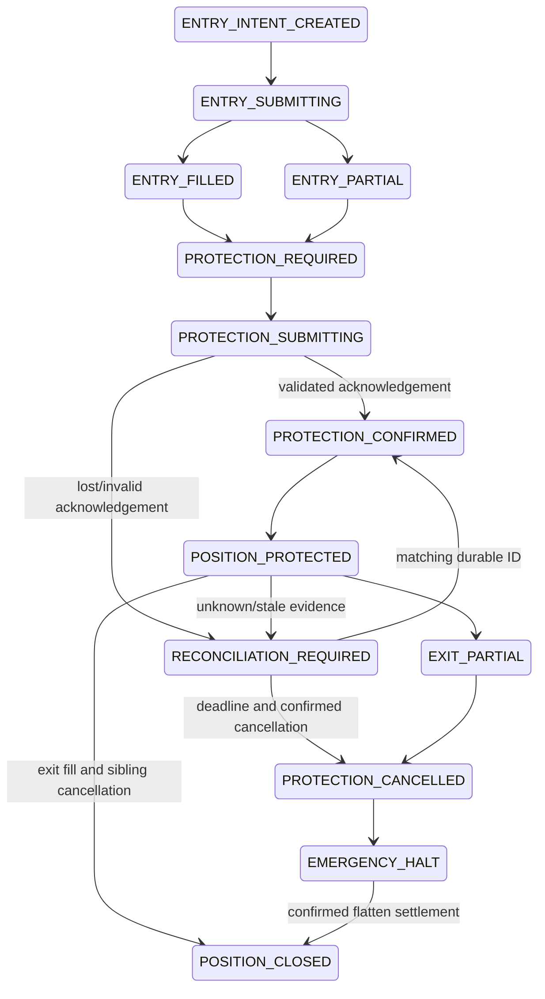

# Protective lifecycle — frozen Fake-only policy

منبع: `execution/protection.py`؛ مقادیر Fill واقعی این سند **Fake** هستند.
سازگاری native API صرافی‌ها `NOT_VERIFIED` است.

Entry intent is reserved before submit; cash, fill, position and protection-required
state settle atomically. Cancelled IOC with a positive partial Fill also needs
protection, sized to actual cumulative filled quantity. New entries pause while
protection is unconfirmed. Every transition carries chained history hashes.
Protection ID is deterministic from entry ID/venue/symbol/role.

Policy A: persist PROTECTION_SUBMITTING and a **5-second** deadline measured
conservatively from entry intent creation, never from restart, before one Fake
submit. An already expired deadline skips registration and reconciles/halts.
On timeout, reconcile by durable ID; never resubmit even after
authoritative absence. Valid ACK must match role, group, quantity, barriers,
venue, adapter, exact current observation, open legs and engineering evidence.
Only then PROTECTION_CONFIRMED → POSITION_PROTECTED.

Policy B: after deadline, **confirmed** absence or invalid coverage permits
confirmed sibling cancellation then one journal-reserved emergency Fake flatten.
Partial TP/SL exit follows cancel-then-flatten of remaining quantity. Unknown
state/cancellation does not permit replacement or a blind sell. Ambiguous flatten
is reconciled by its durable ID without retry. Successful emergency closure leaves
a permanent critical halt, even when exposure is zero.

TP fill cancels/reconciles stop; stop fill cancels/reconciles TP. Exit cash and
position changes are atomic and idempotent. No protected status without ACK.
Restart reads journal and venue Fake evidence before permitting new exposure.

`BinanceSpotProtectiveAdapter`, `OKXSpotProtectiveAdapter` and
`CoinExSpotProtectiveAdapter` are venue-labelled **Fake transport seams** with
distinct adapter identity and `live_adapter_verified=false`. They reject real
transports. They make no assumption about CCXT OCO, STOP_MARKET, trigger orders
or reduceOnly. Native order types, base-fee inventory, dust, exact precision,
latency and actual protective capabilities require later authenticated validation.

Only one active protective group per symbol is allowed in Phase 1; portfolio
scaling and overlapping groups are outside this policy. SQLite/flock is single
host only. Unknown state may retain unprotected exposure: this is reported
critical, never fabricated as protected or zero-risk. Zero-exposure invariant is
tested after **confirmed emergency flatten simulation**, not claimed during outage.
